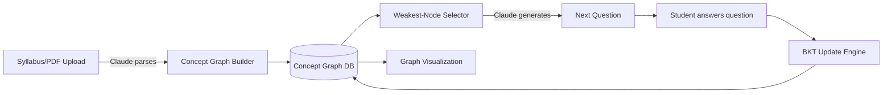

# MasteryMap — Implementation Plan
### Adaptive Knowledge-Graph Tutor | Prometheus July AI Challenge

**Timeline reality check:** Today is **July 26, 2026**. Submission deadline is **July 30, 11:59 PM** (no extensions). You have **~5 days**, not two weeks. This plan is scoped to that window — every "stretch" feature is explicitly separable so the MVP is never at risk.

This document is written to be handed directly to an agentic coding tool (Claude Code, Codex, etc.) as the source of truth. Each phase below is a self-contained prompt/task an agent can execute in order. Copy the relevant section into your agent's task input, or point the agent at this whole file and say "execute Phase 1."

---

## 1. One-Line Pitch

**MasteryMap** turns any syllabus or textbook chapter into a living knowledge graph. As a student answers questions, a Bayesian Knowledge Tracing model updates real mastery estimates per concept — not vibes — and Claude generates the next question targeted at the weakest prerequisite node. The student watches their own understanding light up the graph in real time.

## 2. Why This Scores Well (map to the rubric)

| Criterion | How MasteryMap earns it |
|---|---|
| Educational Impact (25) | Directly targets *why* students plateau: they drill randomly instead of their actual weak prerequisites. Mastery is quantified, not guessed. |
| Creative Use of AI/ML (25) | Two AI components working together: a statistical mastery model (BKT/IRT — real ML, not a prompt) *and* an LLM for question generation/explanation. Judges see more than an API wrapper. |
| Technical Execution (25) | Deterministic, testable core (the BKT update is just math — easy to make rock-solid) + a visually polished graph UI. |
| Pitch & Demo (25) | The graph animating live is the single best 15-second visual you can put in a 2-minute video. |

---

## 3. Tech Stack

| Layer | Choice | Why |
|---|---|---|
| Backend | FastAPI (Python) | Fast to scaffold, async, great for an agent to generate cleanly |
| Mastery model | Custom BKT implementation (numpy) | ~80 lines of real math — this is your "creative ML" proof point |
| LLM | Claude API (Sonnet) | Question generation, explanations, syllabus parsing |
| Frontend | React + Vite + Tailwind | Fast build, clean styling |
| Graph viz | `react-force-graph` (2D) | Drop-in force-directed graph, minimal custom code needed |
| DB | SQLite (via SQLAlchemy) | Zero-ops, fine for a hackathon demo |
| Auth | Skip it — single demo user / local session | Don't burn hours on auth |
| Deploy | Render/Railway (backend) + Vercel (frontend), or just run locally for the video | Optional — a great local demo is enough |

---

## 4. Architecture



**Data flow in one sentence:** upload → graph built once → each answer updates one node's mastery probability → the selector picks the lowest-mastery *unlocked* node → Claude writes a question for it → repeat.

---

## 5. Data Models

```python
# models.py
class Concept(Base):
    id: str              # e.g. "algebra.linear_equations"
    label: str            # "Linear Equations"
    prerequisites: list[str]   # ids of concepts that must be mastered first

class MasteryState(Base):
    concept_id: str
    student_id: str
    p_mastery: float      # BKT probability of mastery, 0-1
    attempts: int

class Question(Base):
    id: str
    concept_id: str
    prompt: str
    answer: str
    difficulty: float

class Attempt(Base):
    id: str
    question_id: str
    student_id: str
    correct: bool
    timestamp: datetime
```

## 6. BKT Core (this is the algorithmic heart — get this right first)

Standard 4-parameter BKT per concept:
- `p_init` — prior probability of already knowing it
- `p_transit` — probability of learning it after one attempt
- `p_slip` — probability of a correct-knowledge student answering wrong
- `p_guess` — probability of a no-knowledge student answering right

Update rule on observing correctness `c`:
```
p_correct_given_know = 1 - p_slip
p_correct_given_not  = p_guess

# Bayes update
if c:
    p_know_post = (p_mastery * p_correct_given_know) / \
                  (p_mastery * p_correct_given_know + (1-p_mastery) * p_correct_given_not)
else:
    p_know_post = (p_mastery * p_slip) / \
                  (p_mastery * p_slip + (1-p_mastery) * (1-p_guess))

# learning transition
p_mastery_new = p_know_post + (1 - p_know_post) * p_transit
```
Ship this with default params (`p_init=0.3, p_transit=0.15, p_slip=0.1, p_guess=0.2`) — don't over-engineer per-concept calibration for the MVP.

## 7. API Endpoints

| Method | Path | Purpose |
|---|---|---|
| POST | `/syllabus/upload` | Accepts text/PDF, Claude extracts concepts + prerequisite edges |
| GET | `/graph/{student_id}` | Returns full graph with current mastery per node (for viz) |
| GET | `/next-question/{student_id}` | Selects weakest unlocked concept, returns a Claude-generated question |
| POST | `/answer` | Submits `{question_id, student_id, answer}`, runs BKT update, returns correctness + explanation |
| GET | `/student/{id}/summary` | Overall mastery %, concepts mastered, recommended focus area |

## 8. Feature Scope

**MVP (must ship — this is what gets demoed):**
- [ ] Upload a syllabus/topic list → Claude generates a concept graph (10-20 nodes) with prerequisite edges
- [ ] BKT engine updates mastery per answer
- [ ] Weakest-node selector picks next question target
- [ ] Claude generates the question + a short explanation on wrong answers
- [ ] Force-directed graph UI: node color/size = mastery level, animates on update
- [ ] Working end-to-end loop: answer → graph updates → new question appears

**Stretch (only after MVP is demo-ready):**
- [ ] Multiple students / login
- [ ] Difficulty adaptation within a concept (not just concept selection)
- [ ] Export a "mastery report" PDF
- [ ] Voice input via Whisper

Do not start stretch items until MVP is fully working and recorded as a fallback demo take.

## 9. Repository Structure

```
masterymap/
├── backend/
│   ├── main.py                 # FastAPI app, route registration
│   ├── models.py                # SQLAlchemy models (Section 5)
│   ├── bkt.py                    # BKT engine (Section 6) — pure functions, easy to unit test
│   ├── graph_builder.py          # Claude call: syllabus text -> concept graph JSON
│   ├── question_gen.py           # Claude call: concept + weak-point -> question + explanation
│   ├── selector.py                # weakest-unlocked-node logic
│   ├── db.py
│   └── tests/
│       ├── test_bkt.py
│       └── test_selector.py
├── frontend/
│   ├── src/
│   │   ├── App.jsx
│   │   ├── components/
│   │   │   ├── GraphView.jsx      # react-force-graph wrapper
│   │   │   ├── QuestionPanel.jsx
│   │   │   └── MasteryBar.jsx
│   │   └── api.js                 # fetch wrappers for backend
│   └── package.json
├── docs/
│   ├── ARCHITECTURE.md
│   ├── API.md
│   └── DEMO_SCRIPT.md
├── README.md
└── .env.example
```

---

## 10. Day-by-Day Build Plan (5 days)

### Day 1 (Jul 26, today) — Skeleton + BKT core
- [ ] Scaffold FastAPI backend + SQLite models
- [ ] Implement and **unit test** `bkt.py` in isolation (this is your technical-execution safety net — get it bulletproof early)
- [ ] Scaffold React app with Vite + Tailwind, empty routes
- [ ] `.env.example` + Claude API key wiring, confirm a basic call works end-to-end

**Agent prompt for today:**
> "Build the FastAPI backend skeleton per Section 5/6/9 of MASTERYMAP_IMPLEMENTATION_PLAN.md. Implement `bkt.py` exactly per Section 6 with full unit tests covering: student starts unknown and answers correctly 3x (mastery should rise), student answers incorrectly repeatedly (mastery should stay low), edge cases at p=0 and p=1."

### Day 2 — Graph generation + selector
- [ ] `graph_builder.py`: prompt Claude to take a syllabus topic and output a JSON concept graph (nodes + prerequisite edges). Validate output is a DAG (no cycles) before saving.
- [ ] `selector.py`: given the graph + mastery states, return the lowest-mastery concept whose prerequisites are all above a mastery threshold (e.g. 0.6)
- [ ] Seed one demo syllabus (e.g. "Algebra I: linear equations through quadratics") so you always have a working fallback dataset

### Day 3 — Question generation + full loop
- [ ] `question_gen.py`: Claude call producing `{question, correct_answer, explanation}` for a given concept
- [ ] Wire `/next-question` and `/answer` endpoints end-to-end
- [ ] Manual test: run the full loop 15+ times via API calls/Postman, confirm mastery values move sensibly

### Day 4 — Frontend + polish
- [ ] `GraphView.jsx`: render nodes colored/sized by mastery, animate transitions on update
- [ ] `QuestionPanel.jsx`: display question, capture answer, show explanation on wrong answers
- [ ] Connect frontend to backend, full click-through demo working locally
- [ ] Write `README.md`, `docs/ARCHITECTURE.md`, `docs/API.md`

### Day 5 (Jul 30) — Freeze, record, submit
- [ ] Feature freeze by midday — **no new features today**, only bug fixes
- [ ] Record demo video (script in Section 12)
- [ ] Push final code to GitHub, confirm README has setup instructions that actually work from a clean clone
- [ ] Submit to Devpost with video + repo link **before 11:59 PM** — don't wait until the last hour

---

## 11. Documentation Deliverables (judges will open these)

**`README.md` must include:**
1. One-paragraph pitch (copy Section 1)
2. Screenshot/GIF of the graph in action
3. Setup instructions that work from `git clone` on a clean machine (test this yourself — this is a common way teams lose Technical Execution points)
4. Tech stack list
5. Link to demo video

**`docs/ARCHITECTURE.md`:** the diagram in Section 4 plus a paragraph on the BKT model and why it's more than a prompt.

**`docs/API.md`:** the endpoint table in Section 7 with example request/response JSON for each.

**Inline code docs:** every function in `bkt.py` and `selector.py` gets a docstring explaining the *why*, not just the *what* — judges reading code care about reasoning.

---

## 12. Demo Video Script (2:00 max, judges stop watching after 2:00)

| Time | Content |
|---|---|
| 0:00–0:15 | The problem: "Students drill randomly instead of their actual weak spots — because nobody's tracking real mastery." |
| 0:15–0:30 | Show syllabus upload → graph appears |
| 0:30–1:15 | Live loop: answer a question wrong → node stays dim, Claude gives explanation → answer the *prerequisite* correctly → watch it light up → next question auto-targets the right node |
| 1:15–1:35 | 5-second architecture callout: "This isn't just prompting — a Bayesian Knowledge Tracing model tracks real probability of mastery per concept" |
| 1:35–1:55 | Zoom out on the full graph, mostly lit up — "this is what real personalized learning looks like" |
| 1:55–2:00 | Team name, project name, closing beat |

Record the *why* first — judges watching 100+ videos decide in the first 10 seconds whether to keep paying attention.

---

## 13. Testing Checklist (Technical Execution points)

- [ ] `bkt.py` unit tests pass (Day 1)
- [ ] Generated concept graphs are always valid DAGs (no cycles) — add an assertion in `graph_builder.py`
- [ ] App doesn't crash on a malformed/empty syllabus upload — add basic input validation
- [ ] Full loop tested 15+ times manually with varied right/wrong answer patterns
- [ ] Fresh clone + README instructions actually produce a running app (test on a second machine or clean venv)

## 14. Submission Checklist

- [ ] GitHub repo public, README complete
- [ ] Demo video ≤ 2:00, uploaded and linked
- [ ] Devpost submission form filled out with team members, tech used, and challenges faced
- [ ] Confirm all core logic (`bkt.py`, `graph_builder.py`, `question_gen.py`, `selector.py`) was written within the hackathon window per originality rules
- [ ] Submitted before July 30, 11:59 PM — aim to submit by 8 PM to leave buffer for upload issues
